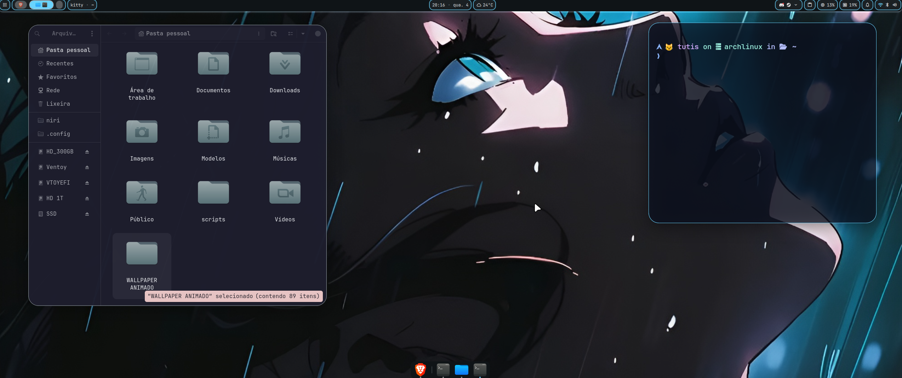
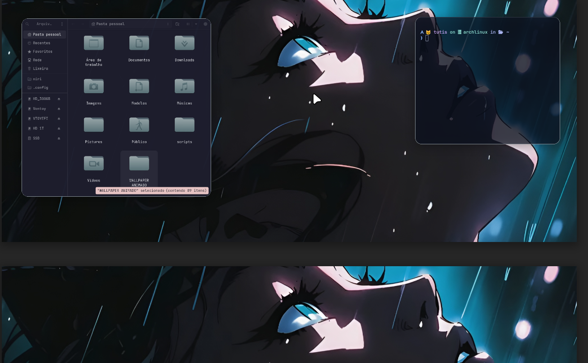

# Hyprland-Config (stack personalizada)

Stack atual:
- Niri / Hyprland (auto-detect no install)
- Kitty (tema glass/tahoe)
- Yazi
- Thunar
- Quickshell
- Shell aliases + Starship + fzf + eza + nvim base
- GTK + Fontconfig (Matugen-friendly)
- Waypaper + mpvpaper (video/gif wallpaper)
- nwg-look + temas GTK (Catppuccin/WhiteSur) + ícones Papirus

## Screenshots




## Instalação

```bash
bash install.sh
```

Forçar compositor:

```bash
bash install.sh niri
bash install.sh hyprland
```

O script:
- instala pacotes base + fontes (Nerd/Emoji)
- instala stack de wallpaper (waypaper + mpvpaper)
- inclui `socat` (necessário para fluxo de troca/controle de wallpaper)
- detecta Niri/Hyprland automaticamente
- aplica só as configs do compositor ativo
- remove symlinks do compositor inativo
- instala Flatpaks padrão da stack

Atalhos (Niri):
- `Mod+Shift+W` abre o Waypaper (backend mpvpaper)
- ao iniciar sessão: `waypaper --restore`

## Modo Bare Repo (opcional)

```bash
./scripts/bare-repo.sh init https://github.com/<user>/Hyprland-Config.git
./scripts/bare-repo.sh config status
```

Isso cria `~/.cfg` (bare) para gerenciar dotfiles direto do `$HOME`.

## Flatpaks padrão

O `install.sh` também garante Flathub e instala:

- be.alexandervanhee.gradia
- com.brave.Browser
- com.dec05eba.gpu_screen_recorder
- com.spotify.Client
- com.vscodium.codium
- com.vysp3r.ProtonPlus
- io.github.IshuSinghSE.aurynk
- io.github.kolunmi.Bazaar
- io.github.ltiber.Pwall
- io.github.swordpuffin.wardrobe
- org.prismlauncher.PrismLauncher

Comando equivalente manual:

```bash
flatpak remote-add --if-not-exists flathub https://flathub.org/repo/flathub.flatpakrepo
flatpak install -y flathub \
  be.alexandervanhee.gradia \
  com.brave.Browser \
  com.dec05eba.gpu_screen_recorder \
  com.spotify.Client \
  com.vscodium.codium \
  com.vysp3r.ProtonPlus \
  io.github.IshuSinghSE.aurynk \
  io.github.kolunmi.Bazaar \
  io.github.ltiber.Pwall \
  io.github.swordpuffin.wardrobe \
  org.prismlauncher.PrismLauncher
```

## Shell

O script adiciona source em `~/.bashrc` para:
- `~/.config/shell/env.sh`
- `~/.config/shell/aliases.sh`
- `~/.config/shell/starship-init.sh`
